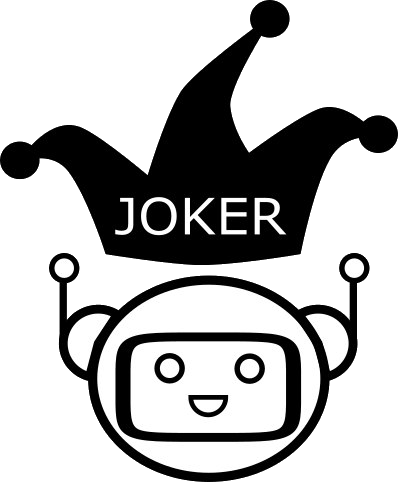

# JOKER
<p align="center">
  
</p>

 [Home](https://www.joker-project.com/clef-2024/) | [Tasks](https://www.joker-project.com/clef-2024/tasks) | [CLEF program](program) | [Publications](publications) | [Partners](partners) | [Contest](contest) | [Contact Us](contact)| [CLEF 2022](https://www.joker-project.com/clef-2022/EN/project) | [CLEF 2023](https://www.joker-project.com/clef-2023/)
<br>

<br>
  <h1 align="center">CLEF 2024 JOKER Track:</h1>
  <h2 align="center">Automatic Humour Analysis</h2> 

### Topic and goals
Humour is one of the most important aspects of social interaction. Despite significant advances in AI and NLP, humour understanding is still a challenge as it often involves understanding implicit cultural references and/or double meanings. The goal of the JOKER lab is to bring together linguists, and computer scientists to create reusable test collections to foster work on automatic humor analysis. Thus, we decided to enlarge the scope of the task by tackling humour in general instead of wordplay. We will continue an unshared task with the aim of attracting runs with new use cases, e.g. pun generation or humour evaluation using our corpus. Additionally, we hope to be able to expand our corpus to several other languages after this test run in English only. Differently from the state-of-the-art, in JOKER-2024 we will focus on automatic classification of humour. This proposal describes the tasks we suggest for the 2024 edition of the JOKER track but we will organize a break-out session at CLEF 2023 in order to discuss with our participants the final track setup for the next iteration at CLEF 2024.

### Relevance to CLEF and the significance for the field
JOKER lies at the intersection of multiple fields, including natural language processing, information retrieval, AI, and human-computer interaction, as well as linguistics, philosophy, and psychology. As we showed in JOKER-2023 [1], [2], automatic humor analysis, including wordplay detection, is still a challenge even for LLMs. To assess the performance of models it is crucial to have test collections and standardized benchmarks. These resources are also valuable for the evaluation of model performance even in the case of zero and few-shot settings. A few humour corpora do exist, including the datasets created for shared tasks of the International Workshop on Semantic Evaluation (SemEval): #HashtagWars: Learning a Sense of Humor [3], Detection and Interpretation of English Puns [4], Assessing Humor in Edited News Headlines [5], and Hackathon: Detecting and Rating Humor and Offense [6]. In [7] the authors collected 16,000 humorous sentences and an equal number of negative samples from news titles, proverbs, the British National Corpus, and the Open Mind Common-Sense dataset. Another dataset contains 2,400 puns and non-puns from news sources, Yahoo!Answers, and proverbs [8], [9]. Most datasets are in English, with some notable exceptions in Italian [10], Russian [11], [12], and Spanish [13]. To the best of our knowledge, the corpus we constructed within the frame of the JOKER track [1], [2] is the first one for wordplay detection in French. To create a new corpus that includes advanced sentiment and humor category labels, we will reuse the existing English corpora as a starting point. 

### Usage scenarios and domains of application
Humor involves complex linguistic phenomena, such as wordplay, irony, sarcasm, and puns. Automatic humor classification helps in developing more sophisticated language models and conversational agents that can engage in humorous interactions and generate humorous content. The test collection will be also valuable for digital humanities, humor research and second language learners.
<br>

### References
[1]	  L. Ermakova, A.-G. Bosser, A. Jatowt, et T. Miller, « The JOKER Corpus: English–French Parallel Data for Multilingual Wordplay Recognition », in SIGIR ’23: Proceedings of the 46th International ACM SIGIR Conference on Research and Development in Information Retrieval, New York, NY: Association for Computing Machinery, 2023. doi: 10.1145/3539618.3591885. <br>
[2]	  L. Ermakova, T. Miller, A.-G. Bosser, V. M. Palma Preciado, G. Sidorov, et A. Jatowt, « Overview of JOKER - CLEF-2023 track on Automatic Wordplay Analysis », in Experimental IR Meets Multilinguality, Multimodality, and Interaction. Proceedings of the Fourteenth International Conference of the CLEF Association (CLEF 2023), in LNCS. Springer, 2023. <br>
[3]	  P. Potash, A. Romanov, et A. Rumshisky, « SemEval-2017 Task 6: #HashtagWars: Learning a Sense of Humor », in Proceedings of the 11th International Workshop on Semantic Evaluation, août 2017, p. 49‑57. doi: 10.18653/v1/S17-2004. <br>
[4]	  T. Miller, « The Punster’s Amanuensis: The Proper Place of Humans and Machines in the Translation of Wordplay », in Proceedings of the Second Workshop on Human-Informed Translation and Interpreting Technology (HiT-IT 2019), sept. 2019, p. 57‑64. doi: 10.26615/issn.2683-0078.2019_007. <br>
[5]	  N. Hossain, J. Krumm, M. Gamon, et H. Kautz, « SemEval-2020 Task 7: Assessing Humor in Edited News Headlines », in Proceedings of the Fourteenth Workshop on Semantic Evaluation, International Committee for Computational Linguistics, déc. 2020, p. 746‑758. [En ligne]. Disponible sur: https://aclanthology.org/2020.semeval-1.98 <br>
[6]	  J. A. Meaney, S. Wilson, L. Chiruzzo, A. Lopez, et W. Magdy, « SemEval-2021 Task 7: HaHackathon, Detecting and Rating Humor and Offense », in Proceedings of the 15th International Workshop on Semantic Evaluation, Association for Computational Linguistics, août 2021, p. 105‑119. doi: 10.18653/v1/2021.semeval-1.9. <br>
[7]	  R. Mihalcea et C. Strapparava, « Making Computers Laugh: Investigations in Automatic Humor Recognition », in Proceedings of Human Language Technology Conference and Conference on Empirical Methods in Natural Language Processing, Vancouver, British Columbia, Canada: Association for Computational Linguistics, oct. 2005, p. 531‑538. [En ligne]. Disponible sur: https://www.aclweb.org/anthology/H05-1067 <br>
[8]	  A. Cattle et X. Ma, « Recognizing Humour using Word Associations and Humour Anchor Extraction », in Proceedings of the 27th International Conference on Computational Linguistics, Santa Fe, New Mexico, USA: Association for Computational Linguistics, août 2018, p. 1849‑1858. [En ligne]. Disponible sur: https://www.aclweb.org/anthology/C18-1157 <br>
[9]	  D. Yang, A. Lavie, C. Dyer, et E. Hovy, « Humor Recognition and Humor Anchor Extraction », in Proceedings of the 2015 Conference on Empirical Methods in Natural Language Processing, Lisbon, Portugal: Association for Computational Linguistics, sept. 2015, p. 2367‑2376. doi: 10.18653/v1/D15-1284. <br>
[10]	A. Reyes, D. Buscaldi, et P. Rosso, « An Analysis of the Impact of Ambiguity on Automatic Humour Recognition », in Text, Speech and Dialogue, V. Matoušek et P. Mautner, Éd., in Lecture Notes in Computer Science. Berlin, Heidelberg: Springer, 2009, p. 162‑169. doi: 10.1007/978-3-642-04208-9_25. <br>
[11]	V. Blinov, V. Bolotova-Baranova, et P. Braslavski, « Large Dataset and Language Model Fun-Tuning for Humor Recognition », in Proceedings of the 57th Annual Meeting of the Association for Computational Linguistics, Florence, Italy: Association for Computational Linguistics, 2019, p. 4027‑4032. doi: 10.18653/v1/P19-1394. <br>
[12]	A. Ermilov, N. Murashkina, V. Goryacheva, et P. Braslavski, « Stierlitz Meets SVM: Humor Detection in Russian », in Artificial Intelligence and Natural Language, D. Ustalov, A. Filchenkov, L. Pivovarova, et J. Žižka, Éd., in Communications in Computer and Information Science. Cham: Springer International Publishing, 2018, p. 178‑184. doi: 10.1007/978-3-030-01204-5_17. <br>
[13]	S. Castro, L. Chiruzzo, A. Rosá, D. Garat, et G. Moncecchi, « A Crowd-Annotated Spanish Corpus for Humor Analysis », in Proceedings of the Sixth International Workshop on Natural Language Processing for Social Media, Melbourne, Australia: Association for Computational Linguistics, juill. 2018, p. 7‑11. doi: 10.18653/v1/W18-3502. <br>
[14]	T. Miller, C. F. Hempelmann, et I. Gurevych, « SemEval-2017 Task 7: Detection and Interpretation of English Puns », in Proceedings of the 11th International Workshop on Semantic Evaluation (SemEval-2017), août 2017, p. 58‑68. doi: 10.18653/v1/S17-2005. <br>


## How to Cite
If you extend or use this work, please cite the [paper](https://link.springer.com/chapter/10.1007/978-3-031-13643-6_27) where it was introduced:
```
Liana Ermakova, Tristan Miller, Fabio Regattin, Anne-Gwenn Bosser, Claudine Borg, Élise Mathurin, Gaëlle Le Corre, 
Sílvia Araújo, Radia Hannachi, Julien Boccou, Albin Digue, Aurianne Damoy & Benoît Jeanjean, 2022. 
Overview of JOKER@ CLEF 2022: Automatic Wordplay and Humour Translation workshop. 
In International Conference of the Cross-Language Evaluation Forum for European Languages (pp. 447-469). Springer, Cham.
```
[Paper](https://link.springer.com/chapter/10.1007/978-3-031-13643-6_27)

[Dowload .BIB](../clef-2022/BibTex/joker-clef-2022.bib)


<p>
<em>This project has received a government grant managed by the National Research Agency under the program "Investissements d'avenir" integrated into France 2030, with the Reference ANR-19-GURE-0001.</em>
</p>
<p>
<em>JOKER is supported by The Human Science Institute in Brittany (MSHB)</em>
</p>
<div align="center">
  <a href="https://www.mshb.fr"></a>
  <a href="https://sea-eu.org/?lang=fr"></a>
  <a href="https://www.gouvernement.fr/le-programme-d-investissements-d-avenir"></a>
</div>
<br />
<div align="center">
  <a href="https://clef2022.clef-initiative.eu/index.php"></a> 
</div>

