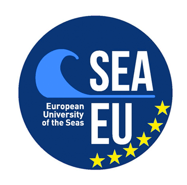
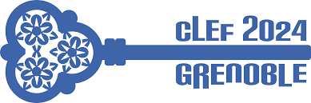

# JOKER

  

[Home](index) | Tasks | [CLEF program](program) | [Publications](publications) | [Partners](partners) | [Contest](contest) | [Contact Us](contact) | [Tools](tools) | [CLEF 2022](https://www.joker-project.com/clef-2022/EN/project) | [CLEF 2023](https://www.joker-project.com/clef-2023/)
 

 
  <h1 align="center">CLEF 2024 JOKER Track:</h1>
  <h2 align="center">Automatic Humor Analysis</h2> 

### Tasks, evaluation setup, and metrics
In the edition, we propose three shared tasks:
* **Task 1: Humour-aware information retrieval** Retrieving short humorous texts from a document collection.
* **Task 2: Humour classification according to genre and technique** 
* **Task 3: Pun translation** Translate English punning jokes into French preserving wordplay form and wordplay meaning.
* **Open Task:** In addition, we encourage the use of our data for tasks related to computational wordplay and humour. These could take the form of experiment reports on humour perception, evaluation, wordplay generation, or user studies. Register for any of the aforementioned shared task if you are interested in this open task.

<em>This project has received a government grant managed by the National Research Agency under the program "Investissements d'avenir" integrated into France 2030, with the Reference ANR-19-GURE-0001.</em>

<em>JOKER is supported by The Human Science Institute in Brittany (MSHB)</em>

  
  
  

 

   

